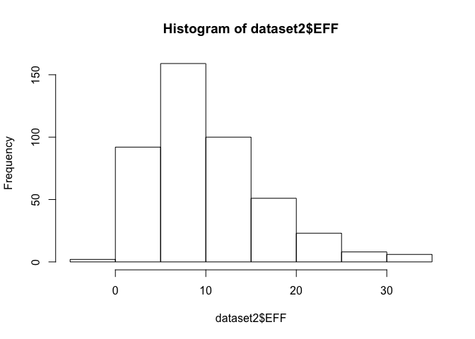

HW02: Basics of Data Frames
================
Woo Sik (Lewis) Kim

Importing the data set in different ways; first, using "read.csv()", then "read\_csv()":

Using "read.csv()", and displaying the resulting data frame:

``` r
dataset1 <- read.csv(file = "data/nba2017-player-statistics.csv",
                     header = TRUE,
                     colClasses = c("Player" = "character",
                     "character",
                     factor, "character", "double",
                     rep("integer", 19)))
```

    ## Warning in read.table(file = file, header = header, sep = sep, quote =
    ## quote, : not all columns named in 'colClasses' exist

``` r
str(dataset1)
```

    ## 'data.frame':    441 obs. of  24 variables:
    ##  $ Player      : chr  "Al Horford" "Amir Johnson" "Avery Bradley" "Demetrius Jackson" ...
    ##  $ Team        : Factor w/ 30 levels "ATL","BOS","BRK",..: 2 2 2 2 2 2 2 2 2 2 ...
    ##  $ Position    : Factor w/ 5 levels "C","PF","PG",..: 1 2 5 3 4 3 4 5 4 2 ...
    ##  $ Experience  : Factor w/ 19 levels "1","10","11",..: 18 3 15 19 18 14 13 11 19 15 ...
    ##  $ Salary      : num  26540100 12000000 8269663 1450000 1410598 ...
    ##  $ Rank        : int  4 6 5 15 11 1 3 13 8 10 ...
    ##  $ Age         : int  30 29 26 22 31 27 26 21 20 29 ...
    ##  $ GP          : int  68 80 55 5 47 76 72 29 78 78 ...
    ##  $ GS          : int  68 77 55 0 0 76 72 0 20 6 ...
    ##  $ MIN         : int  2193 1608 1835 17 538 2569 2335 220 1341 1232 ...
    ##  $ FGM         : int  379 213 359 3 95 682 333 25 192 114 ...
    ##  $ FGA         : int  801 370 775 4 232 1473 720 58 423 262 ...
    ##  $ Points3     : int  86 27 108 1 39 245 157 12 46 45 ...
    ##  $ Points3_atts: int  242 66 277 1 111 646 394 35 135 130 ...
    ##  $ Points2     : int  293 186 251 2 56 437 176 13 146 69 ...
    ##  $ Points2_atts: int  559 304 498 3 121 827 326 23 288 132 ...
    ##  $ FTM         : int  108 67 68 3 33 590 176 6 85 26 ...
    ##  $ FTA         : int  135 100 93 6 41 649 217 9 124 37 ...
    ##  $ OREB        : int  95 117 65 2 17 43 48 6 45 60 ...
    ##  $ DREB        : int  369 248 269 2 68 162 367 20 175 213 ...
    ##  $ AST         : int  337 140 121 3 33 449 155 4 64 71 ...
    ##  $ STL         : int  52 52 68 0 9 70 72 10 35 26 ...
    ##  $ BLK         : int  87 62 11 0 7 13 23 2 18 17 ...
    ##  $ TO          : int  116 77 88 0 25 210 79 4 68 39 ...

Using "read\_csv()", and displaying the resulting data frame (I will be using the data set from read\_csv() for the remainder of the homework):

``` r
require(readr)
```

    ## Loading required package: readr

``` r
library(dplyr)
```

    ## Warning: package 'dplyr' was built under R version 3.4.2

    ## 
    ## Attaching package: 'dplyr'

    ## The following objects are masked from 'package:stats':
    ## 
    ##     filter, lag

    ## The following objects are masked from 'package:base':
    ## 
    ##     intersect, setdiff, setequal, union

``` r
dataset2 <- read_csv('data/nba2017-player-statistics.csv',
                     col_types =
                       list(
                         Player = col_character(),
                         Team = col_character(),
                         Position = col_factor(c('C', 'PF','PG','SF','SG')),
                         Experience = col_character(),
                         Salary = col_double(),
                         Rank = col_integer(),
                         Age = col_integer(),
                         GP = col_integer(),
                         GS = col_integer(),
                         MIN = col_integer(),
                         FGM = col_integer(),
                         FGA = col_integer(),
                         Points3 = col_integer(),
                         Points3_atts = col_integer(),
                         Points2 = col_integer(),
                         Points2_atts = col_integer(),
                         FTM = col_integer(),
                         FTA = col_integer(),
                         OREB = col_integer(),
                         DREB = col_integer(),
                         AST = col_integer(),
                         STL = col_integer(),
                         BLK = col_integer(),
                         TO = col_integer()
                         ))
str(dataset2)
```

    ## Classes 'tbl_df', 'tbl' and 'data.frame':    441 obs. of  24 variables:
    ##  $ Player      : chr  "Al Horford" "Amir Johnson" "Avery Bradley" "Demetrius Jackson" ...
    ##  $ Team        : chr  "BOS" "BOS" "BOS" "BOS" ...
    ##  $ Position    : Factor w/ 5 levels "C","PF","PG",..: 1 2 5 3 4 3 4 5 4 2 ...
    ##  $ Experience  : chr  "9" "11" "6" "R" ...
    ##  $ Salary      : num  26540100 12000000 8269663 1450000 1410598 ...
    ##  $ Rank        : int  4 6 5 15 11 1 3 13 8 10 ...
    ##  $ Age         : int  30 29 26 22 31 27 26 21 20 29 ...
    ##  $ GP          : int  68 80 55 5 47 76 72 29 78 78 ...
    ##  $ GS          : int  68 77 55 0 0 76 72 0 20 6 ...
    ##  $ MIN         : int  2193 1608 1835 17 538 2569 2335 220 1341 1232 ...
    ##  $ FGM         : int  379 213 359 3 95 682 333 25 192 114 ...
    ##  $ FGA         : int  801 370 775 4 232 1473 720 58 423 262 ...
    ##  $ Points3     : int  86 27 108 1 39 245 157 12 46 45 ...
    ##  $ Points3_atts: int  242 66 277 1 111 646 394 35 135 130 ...
    ##  $ Points2     : int  293 186 251 2 56 437 176 13 146 69 ...
    ##  $ Points2_atts: int  559 304 498 3 121 827 326 23 288 132 ...
    ##  $ FTM         : int  108 67 68 3 33 590 176 6 85 26 ...
    ##  $ FTA         : int  135 100 93 6 41 649 217 9 124 37 ...
    ##  $ OREB        : int  95 117 65 2 17 43 48 6 45 60 ...
    ##  $ DREB        : int  369 248 269 2 68 162 367 20 175 213 ...
    ##  $ AST         : int  337 140 121 3 33 449 155 4 64 71 ...
    ##  $ STL         : int  52 52 68 0 9 70 72 10 35 26 ...
    ##  $ BLK         : int  87 62 11 0 7 13 23 2 18 17 ...
    ##  $ TO          : int  116 77 88 0 25 210 79 4 68 39 ...
    ##  - attr(*, "spec")=List of 2
    ##   ..$ cols   :List of 24
    ##   .. ..$ Player      : list()
    ##   .. .. ..- attr(*, "class")= chr  "collector_character" "collector"
    ##   .. ..$ Team        : list()
    ##   .. .. ..- attr(*, "class")= chr  "collector_character" "collector"
    ##   .. ..$ Position    :List of 3
    ##   .. .. ..$ levels    : chr  "C" "PF" "PG" "SF" ...
    ##   .. .. ..$ ordered   : logi FALSE
    ##   .. .. ..$ include_na: logi FALSE
    ##   .. .. ..- attr(*, "class")= chr  "collector_factor" "collector"
    ##   .. ..$ Experience  : list()
    ##   .. .. ..- attr(*, "class")= chr  "collector_character" "collector"
    ##   .. ..$ Salary      : list()
    ##   .. .. ..- attr(*, "class")= chr  "collector_double" "collector"
    ##   .. ..$ Rank        : list()
    ##   .. .. ..- attr(*, "class")= chr  "collector_integer" "collector"
    ##   .. ..$ Age         : list()
    ##   .. .. ..- attr(*, "class")= chr  "collector_integer" "collector"
    ##   .. ..$ GP          : list()
    ##   .. .. ..- attr(*, "class")= chr  "collector_integer" "collector"
    ##   .. ..$ GS          : list()
    ##   .. .. ..- attr(*, "class")= chr  "collector_integer" "collector"
    ##   .. ..$ MIN         : list()
    ##   .. .. ..- attr(*, "class")= chr  "collector_integer" "collector"
    ##   .. ..$ FGM         : list()
    ##   .. .. ..- attr(*, "class")= chr  "collector_integer" "collector"
    ##   .. ..$ FGA         : list()
    ##   .. .. ..- attr(*, "class")= chr  "collector_integer" "collector"
    ##   .. ..$ Points3     : list()
    ##   .. .. ..- attr(*, "class")= chr  "collector_integer" "collector"
    ##   .. ..$ Points3_atts: list()
    ##   .. .. ..- attr(*, "class")= chr  "collector_integer" "collector"
    ##   .. ..$ Points2     : list()
    ##   .. .. ..- attr(*, "class")= chr  "collector_integer" "collector"
    ##   .. ..$ Points2_atts: list()
    ##   .. .. ..- attr(*, "class")= chr  "collector_integer" "collector"
    ##   .. ..$ FTM         : list()
    ##   .. .. ..- attr(*, "class")= chr  "collector_integer" "collector"
    ##   .. ..$ FTA         : list()
    ##   .. .. ..- attr(*, "class")= chr  "collector_integer" "collector"
    ##   .. ..$ OREB        : list()
    ##   .. .. ..- attr(*, "class")= chr  "collector_integer" "collector"
    ##   .. ..$ DREB        : list()
    ##   .. .. ..- attr(*, "class")= chr  "collector_integer" "collector"
    ##   .. ..$ AST         : list()
    ##   .. .. ..- attr(*, "class")= chr  "collector_integer" "collector"
    ##   .. ..$ STL         : list()
    ##   .. .. ..- attr(*, "class")= chr  "collector_integer" "collector"
    ##   .. ..$ BLK         : list()
    ##   .. .. ..- attr(*, "class")= chr  "collector_integer" "collector"
    ##   .. ..$ TO          : list()
    ##   .. .. ..- attr(*, "class")= chr  "collector_integer" "collector"
    ##   ..$ default: list()
    ##   .. ..- attr(*, "class")= chr  "collector_guess" "collector"
    ##   ..- attr(*, "class")= chr "col_spec"

Changing all instances of "R" (character) to "0" (integer) in the column "Experience":

``` r
dataset2[dataset2$Experience == "R", "Experience"] <- 0
dataset2$Experience <- as.integer(dataset2$Experience)
```

Computing and adding new columns to dataset2 to calculate EFF:

``` r
Missed_FG <- dataset2$FGA - dataset2$FGM
Missed_FT <- dataset2$FTA - dataset2$FTM
PTS <- 2*dataset2$Points2 + 3*dataset2$Points3 + dataset2$FTM
REB <- dataset2$OREB + dataset2$DREB
MPG <- dataset2$MIN / dataset2$GP

dataset2 <- cbind(dataset2, Missed_FG, Missed_FT, PTS, REB, MPG)

EFF <- (dataset2$PTS + dataset2$REB + dataset2$AST + dataset2$STL + 
          dataset2$BLK - dataset2$Missed_FG - dataset2$Missed_FT - 
          dataset2$TO) / dataset2$GP

dataset2 <- cbind(dataset2, EFF)

Efficiency <- dataset2$EFF
summary(Efficiency)
```

    ##    Min. 1st Qu.  Median    Mean 3rd Qu.    Max. 
    ##  -0.600   5.452   9.090  10.137  13.247  33.840

``` r
hist(Efficiency)
```



Processing the EFF data to get the top 10 players, and their associated name, team, salary, and EFF values:

``` r
desc_eff <- select(dataset2, Player, Team, Salary, EFF)
head(arrange(desc_eff, desc(dataset2$EFF)), 10)
```

    ##                   Player Team   Salary      EFF
    ## 1      Russell Westbrook  OKC 26540100 33.83951
    ## 2           James Harden  HOU 26540100 32.34568
    ## 3          Anthony Davis  NOP 22116750 31.16000
    ## 4           LeBron James  CLE 30963450 30.97297
    ## 5     Karl-Anthony Towns  MIN  5960160 30.32927
    ## 6           Kevin Durant  GSW 26540100 30.19355
    ## 7  Giannis Antetokounmpo  MIL  2995421 28.37500
    ## 8       DeMarcus Cousins  NOP 16957900 27.94118
    ## 9           Jimmy Butler  CHI 17552209 25.60526
    ## 10      Hassan Whiteside  MIA 22116750 25.36364

Obtaining player(s) with a negative EFF value:

``` r
neg_eff <- select(dataset2, Player, EFF)
```

> top 10 players in descending EFF order: Player(s) with a negative EFF value:

Calculating the correlation coefficients between EFF and all the variables used in the EFF formula (in order of ):

``` r
cor(dataset2$EFF, dataset2$PTS)
```

    ## [1] 0.8588644

``` r
cor(dataset2$EFF, dataset2$REB)
```

    ## [1] 0.7634501

``` r
cor(dataset2$EFF, dataset2$AST)
```

    ## [1] 0.6689232

``` r
cor(dataset2$EFF, dataset2$STL)
```

    ## [1] 0.6957286

``` r
cor(dataset2$EFF, dataset2$BLK)
```

    ## [1] 0.5679571

``` r
cor(dataset2$EFF, dataset2$Missed_FG)
```

    ## [1] 0.7722477

``` r
cor(dataset2$EFF, dataset2$Missed_FT)
```

    ## [1] 0.7271456

``` r
cor(dataset2$EFF, dataset2$TO)
```

    ## [1] 0.8003289

``` r
cor(dataset2$EFF, dataset2$GP)
```

    ## [1] 0.4773648
